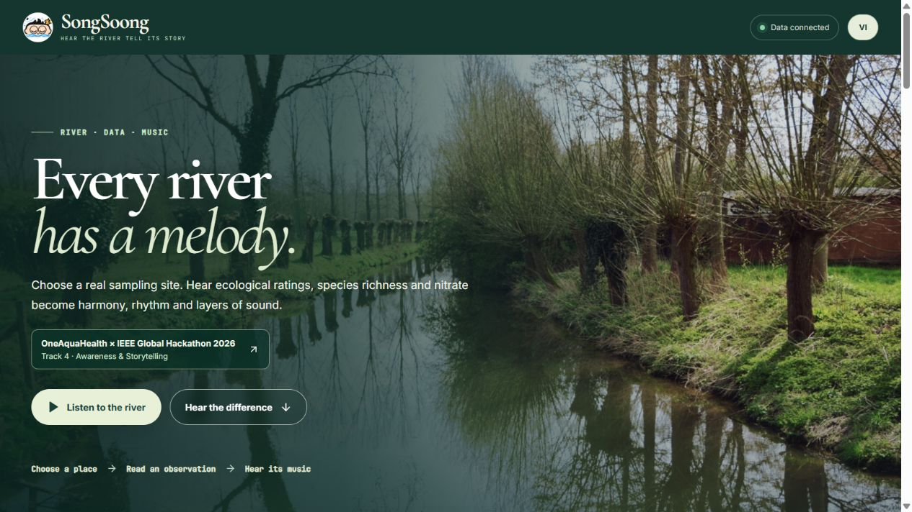
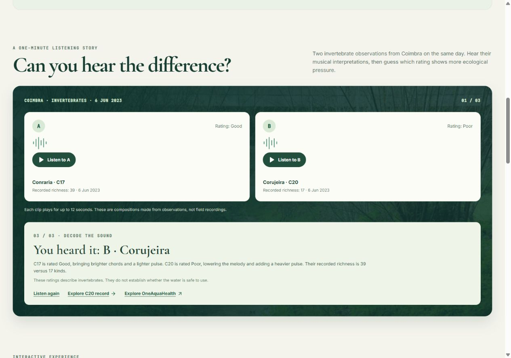

# SongSoong

An interactive river soundscape built from published ENORA observations. Select a city and sampling site to hear a composition built from its available ecological signals. Isolate each signal to hear its contribution. The interface defaults to English and supports Vietnamese.



The guided listening challenge compares two real Coimbra invertebrate observations from 6 June 2023: Conraria (C17, Good, richness 39) and Corujeira (C20, Poor, richness 17). Visitors hear two 12-second compositions, guess which rating indicates greater ecological pressure, and then see the source values and musical mapping. If the live API changes or is unavailable, this comparison uses the bundled ENORA snapshot. The ratings apply to invertebrates and do not establish whether the water is safe to use.



The closing link leads to the official OneAquaHealth Citizen Science App for visitors who want to observe and report their own waterways. SongSoong does not collect citizen observations.

For the project story and a 3–5 minute demo outline, see [DEVPOST_SUBMISSION.md](DEVPOST_SUBMISSION.md).

## Run locally

```bash
npm install
npm run dev
npm test
```

Vite proxies `/api/enora/*` to the public ENORA API. The development URL is `http://localhost:5173`.

## Build and serve

```bash
npm run build
npm start
```

The build refreshes `src/data/enoraSnapshot.json` from `/api/cities/all`, `/api/sites/all`, and `/api/dashboards/city`. If the upstream API is unavailable at build time, it retains the previous snapshot. The Node server serves `dist`, proxies those three GET routes under `/api/enora/*`, and caches upstream responses for 15 minutes. Set `PORT` to change its default port of 4173.

On a static host, the page can still display the bundled snapshot, but the live API badge and refresh require a same-origin proxy for those routes because the upstream API rejects direct browser cross-origin requests.

## Deploy on Vercel

`vercel.json` builds the Vite app and rewrites the three `/api/enora/*` reads to their matching ENORA endpoints. Vercel serves the static `dist` directory; `server.mjs` remains available for local or Node hosting. When a Vercel project is linked to this GitHub repository, pushes to the production branch can deploy automatically.

## Data and imagery

Fish, invertebrate and diatom ratings select a harmonic mood. Their recorded richness changes the density of water-drop accents. Nitrate is shown with its exact published value; its relative rank in the retrieved dataset informs musical tension when selected because the API schema does not specify a unit or safety threshold. The default site composition averages available biological ratings, which may come from different observation dates. Nitrate does not dilute those ratings. Sites with nitrate alone open the relative nitrate reading directly rather than presenting it as a full ecological composition. This is an artistic rule rather than an official water-quality score. The musical mapping is an interpretation of historical records, not a live measurement or water-safety diagnosis.

Each city has its own chord vocabulary, melodic scale, rhythm, bass pulse and lead instrument. Site codes add repeatable small variations within the city's theme. High or Good ecological ratings sound brighter and more open; Moderate ratings alternate between open and darker harmony; Poor or Bad ratings use lower melodies, stronger bass and subtle rough texture. Nitrate adds a secondary texture based on its relative rank in the retrieved dataset. When nitrate is the only signal, its rank sets a relative musical mood. The UI explains the mapping without presenting it as a water-safety score.

Only the five field photographs in `public-live/photos/` are included in the production build. Their original URLs and source pages are recorded in [PHOTO_SOURCES.md](PHOTO_SOURCES.md). The photos depict the city area and are not presented as photos of each selected sampling site.
